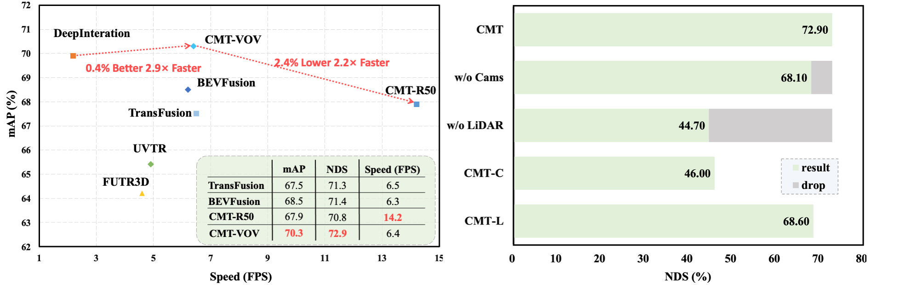
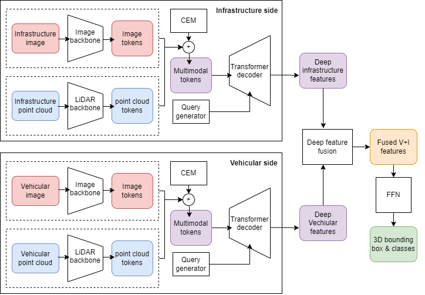

# CMTCoop - Cross Modal Transformers for Cooperative perception

This work is based on the work from ["Cross Modal Transformer: Towards Fast and Robust 3D Object Detection"](https://arxiv.org/pdf/2301.01283.pdf)

## Introduction

<!-- https://user-images.githubusercontent.com/18145538/210828888-a944817a-858f-45ef-8abc-068adeda413f.mp4

<div align="center">
  

  <em> Performance comparison and Robustness under sensor failure. All statistics are measured on a single
Tesla A100 GPU using the best model of official repositories. All models use [spconv](https://github.com/traveller59/spconv) Voxelization module. </em>
</div><br/> -->

CMT is a transformer-based robust 3D detector for end-to-end 3D multi-modal detection. This model is extended to cooperative perception in CMTCoop to perform deep multi-model multi-view feature fusion for 3D object detection.
Through extensive, studies this work shows that the proposed model provides a mAP of 97.x% on multi-modal cooperative fusion (+xx% increase over vehicular perception) and 96.x% on LiDAR only cooperative perception (CMTCoop-L) which runs at near-real time FPS, and a 2.x% performance gain over the current SoTA, BEVFusionCoop.

<br>
<div align="center">
  
</div>

<!-- A DETR-like framework is designed for multi-modal detection(CMT) and lidar-only detection(CMT-L), which obtains **74.1%**(**SoTA without TTA/model ensemble**) and **70.1%** NDS separately on nuScenes benchmark. -->
<!-- Without explicit view transformation, CMT takes the image and point clouds tokens as inputs and directly outputs accurate 3D bounding boxes. CMT can be a strong baseline for further research. -->

## Preparation

### Docker installation

Docker provides an easy way to deal with package dependencies. Use the [Dockerfile](./Dockerfile) provided to build the image.

```bash
docker build . -t cmt-coop
```

Then run the image with the following command

```bash
nvidia-docker run -it --rm \
    --ipc=host --gpus all \
    -v <Path_to_datasets>:/mnt/datasets \
    -v <Path_to_pretrained_models>:/home/pretrained \
    --name cmt-coop \
    cmt-coop bash
```

<!-- ```bash
nvidia-docker run -it -v `pwd`/../data/tumtraf_i:/home/data/tumtraf_i -v <PATH_TO_COOPDET3D>:/home/coopdet3d --shm-size 16g coopdet3d /bin/bash
``` -->

### Manual Installation

Create an new environment with Anaconda or venv if required

```bash
conda create -n cmt-coop
conda activate cmt-coop
```

Install the following packages

- Python == 3.8 
- CUDA == 11.1 
- pytorch == 1.9.1 
- mmcv-full == 1.6.2 
- mmdet == 2.28.2 
- mmsegmentation == 0.30.0
- [mmdet3d](https://github.com/open-mmlab/mmdetection3d) == 1.0.0rc6
- spconv-cu111 == 2.1.21 
- [flash-attn](https://github.com/HazyResearch/flash-attention) == 0.2.2
- [pypcd](https://github.com/klintan/pypcd.git) 
- open3d

Note that the repository was tested on the above versions, but may also work with later versions.

### Dataset

<!-- Follow the [mmdet3d](https://github.com/open-mmlab/mmdetection3d/blob/master/docs/en/data_preparation.md) to process the nuScenes dataset. This is only required to repeat tests on the CMT model.  -->

Download the TUMTraf datasets from the following links:
- [TUMTraf intersection dataset](https://innovation-mobility.com/en/project-providentia/a9-dataset/#anchor_release_2).
- [TUMTraf Cooperative Dataset 500 frames (v0.9)](https://syncandshare.lrz.de/getlink/fiXdMni7DP5bqSsYgSpeLc/traffix-0.9)
- [TUMTraf Cooperative Dataset 800 frames (v1.0)](https://syncandshare.lrz.de/getlink/fi4gZzFh8BUn6Sw4ZC8u49/traffix-1.0). 

Download the [TUMTraf Dataset Development Kit](https://github.com/tum-traffic-dataset/tum-traffic-dataset-dev-kit) and follow the instructions to split the TUMTraf intersection dataset into train and val sets.The TUMTraf cooperative dataset is already split into train and val sets.

```
${Root}
└── datasets
    ├── tumtraf_intersection_dataset
    |    └── train
    |    └── val
    └── tumtraf_cooperative_dataset
         └── train
         └── val
```

Finally ensure that the dataset folder has been softlinked to the `CMTCoop/data` folder.

<!-- Note that the version with 500 frames (v0.9) is provided to reproduce the results listed below and in the paper as they were achieved using this older version of the dataset. The version with 800 frames (v1.0) is the latest one and includes more frames and corrected labels. -->


<!-- * Data   

PKLs and image pretrain weights are available at [Google Drive](https://drive.google.com/drive/folders/1wTdG7oG-l-nMa_400jBwJk4mEQmA_xl3?usp=sharing). -->

## Train & inference
```bash
# train
bash tools/dist_train.sh /path_to_your_config 8
# inference
bash tools/dist_test.sh /path_to_your_config /path_to_your_pth 8 --eval bbox
```


<!-- ## Main Results
Results on nuScenes **val set**. The default batch size is 2 on each GPU. The FPS are all evaluated with a single Tesla A100 GPU. (15e + 5e means the last 5 epochs should be trained without [GTsample](https://github.com/junjie18/CMT/blob/master/projects/configs/fusion/cmt_voxel0075_vov_1600x640_cbgs.py#L48-L87))

| Config            |Modality| mAP      | NDS     | Schedule|Inference FPS|
|:--------:|:----------:|:---------:|:--------:|:--------:|:--------:|
| [vov_1600x640](./projects/configs/camera/cmt_camera_vov_1600x640_cbgs.py) |C| 40.6% | 46.0%  | 20e | 8.4 |
| [voxel0075](./projects/configs/lidar/cmt_lidar_voxel0075_cbgs.py) |L| 62.14% | 68.6%    | 15e+5e | 18.1 |  
| [voxel0100_r50_800x320](./projects/configs/fusion/cmt_voxel0100_r50_800x320_cbgs.py)  |C+L| 67.9%     | 70.8%    | 15e+5e | 14.2 |
| [voxel0075_vov_1600x640](./projects/configs/fusion/cmt_voxel0075_vov_1600x640_cbgs.py)  |C+L| 70.3% | 72.9%    | 15e+5e | 6.4 |

Results on nuScenes **test set**. To reproduce our result, replace `ann_file=data_root + '/nuscenes_infos_train.pkl'` in [training config](./projects/configs/fusion/cmt_voxel0075_vov_1600x640_cbgs.py) with `ann_file=[data_root + '/nuscenes_infos_train.pkl', data_root + '/nuscenes_infos_val.pkl']`:

| Config            |Modality| mAP      | NDS     | Schedule|Inference FPS|
|:--------:|:----------:|:---------:|:--------:|:--------:|:--------:|
| [vov_1600x640](./projects/configs/camera/cmt_camera_vov_1600x640_cbgs.py) |C| 42.9% | 48.1%  | 20e | 8.4 |
| [voxel0075](./projects/configs/lidar/cmt_lidar_voxel0075_cbgs.py) |L| 65.3% | 70.1%    | 15e+5e | 18.1 | 
| [voxel0075_vov_1600x640](./projects/configs/fusion/cmt_voxel0075_vov_1600x640_cbgs.py)  |C+L| 72.0% | **74.1%**    | 15e+5e | 6.4 | -->


## Citation
Please consider citing the original work on CMT if you find this work helpful.

<!-- ## Citation
If you find CMT helpful in your research, please consider citing: 
```bibtex   
@article{yan2023cross,
  title={Cross Modal Transformer via Coordinates Encoding for 3D Object Dectection},
  author={Yan, Junjie and Liu, Yingfei and Sun, Jianjian and Jia, Fan and Li, Shuailin and Wang, Tiancai and Zhang, Xiangyu},
  journal={arXiv preprint arXiv:2301.01283},
  year={2023}
}
``` -->

<!-- ## Contact
If you have any questions, feel free to open an issue or contact us at yanjunjie@megvii.com, liuyingfei@megvii.com, sunjianjian@megvii.com or wangtiancai@megvii.com. -->
